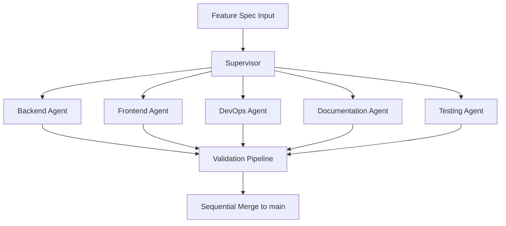

# Documentation Engine: Architecture

This document is auto-updated by the Documentation Agent.

## System Topology

## Principles

- Isolated worktrees per agent.
- Explicit task contracts.
- Required validation gate before merge.
- Deterministic integration order.
